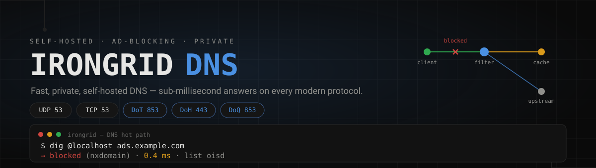
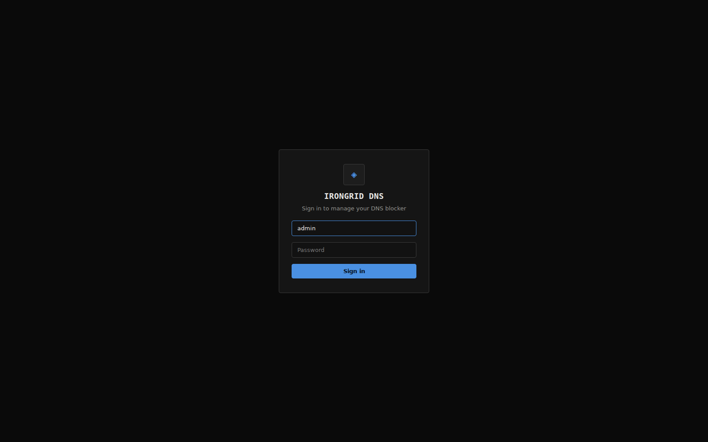
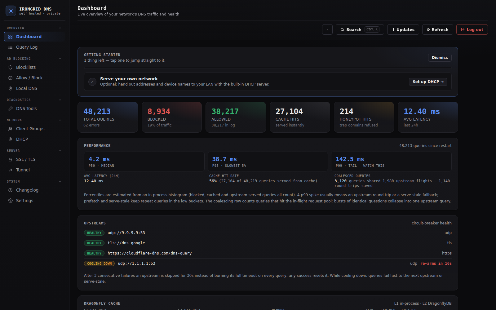
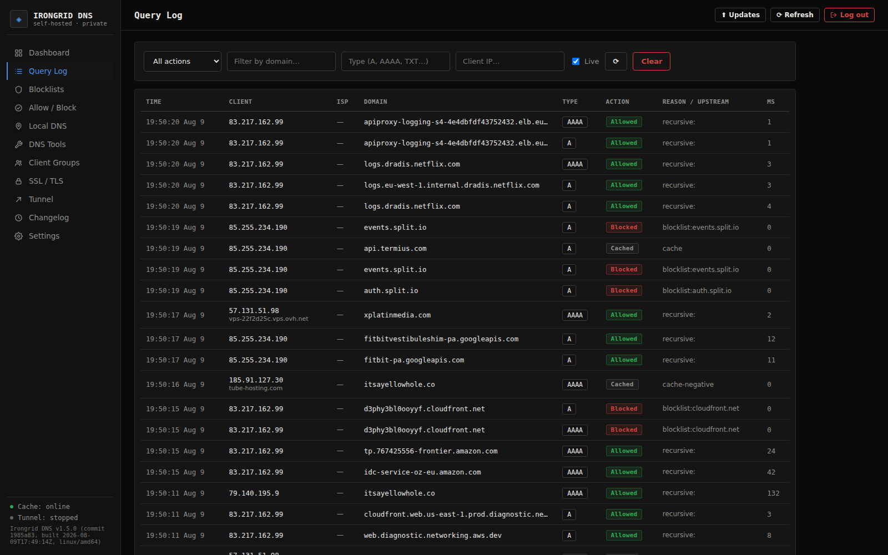
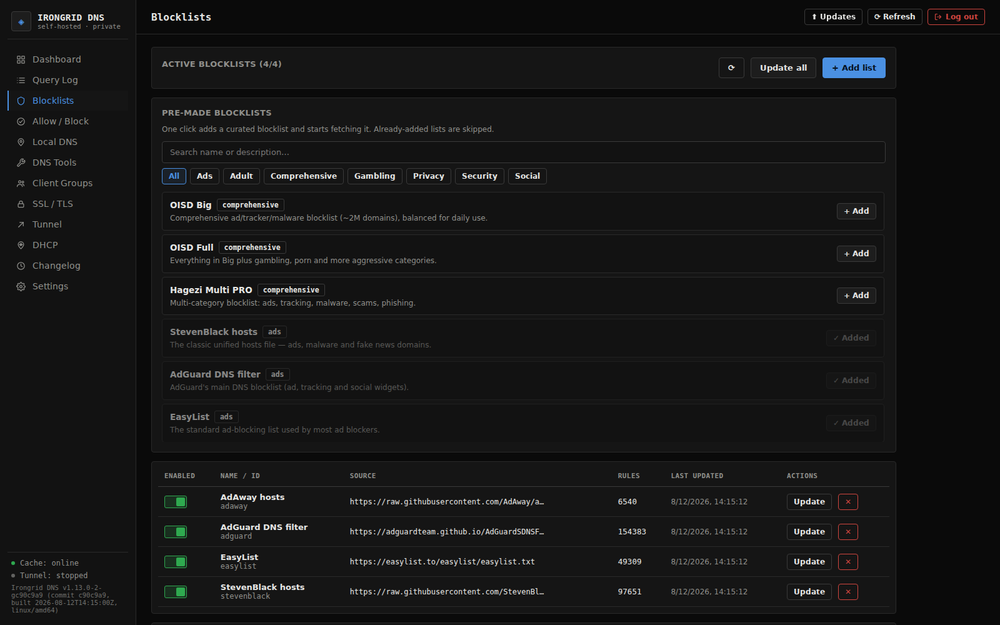
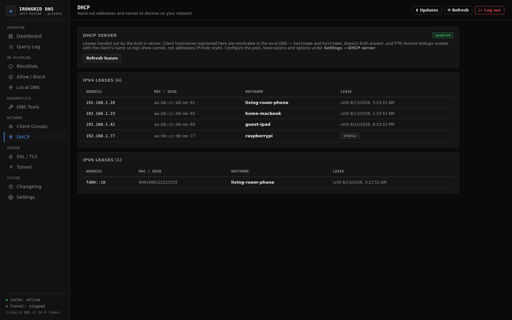
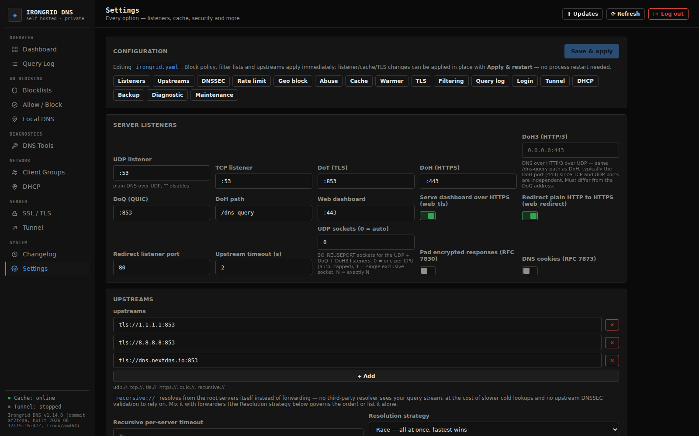

<p align="center">
  <!-- The navy wordmark reads on GitHub's light theme; the light variant is
       swapped in on dark themes via the standard prefers-color-scheme trick. -->
  <picture>
    <source media="(prefers-color-scheme: dark)" srcset="assets/logo-light.svg" />
    
  </picture>
</p>

<p align="center">
  <a href="https://github.com/eoghan2t9/Irongrid-DNS/releases"></a>
  <a href="go.mod"></a>
  <a href=".github/workflows/release.yml"></a>
  <a href="LICENSE"></a>
  
</p>

<p align="center">
  <a href="https://github.com/eoghan2t9/Irongrid-DNS/stargazers"></a>
  <a href="https://github.com/eoghan2t9/Irongrid-DNS/forks"></a>
  <a href="https://github.com/eoghan2t9/Irongrid-DNS/graphs/contributors"></a>
  <a href="https://github.com/eoghan2t9/Irongrid-DNS/commits/main"></a>
  <a href="https://github.com/eoghan2t9/Irongrid-DNS"></a>
</p>

<p align="center">
  <a href="#quick-start"></a>
  <a href="#features"></a>
  <a href="#api"></a>
  <a href="#development"></a>
</p>

A fast, self-hosted, ad-blocking DNS server written in pure Go — a single
self-contained binary with a modern web dashboard. Built to replace slow
commercial ad-blocking DNS with sub-millisecond local responses.

<p align="center">
  
</p>

## Highlights

| ⚡ **Sub-millisecond** | 🛡️ **Ad blocking** | 🌐 **All protocols** | 🕵️ **Private by design** |
|---|---|---|---|
| Dragonfly-backed response cache, typical answers served in < 1 ms | hosts, Adblock & wildcard lists with one-click allow-list overrides | DNS over **UDP · TCP · DoT · DoH · DoQ** on one server | `recursive://` resolves from the root servers itself — no third-party resolver ever sees your queries |

| 📊 **Full dashboard** | 🔐 **TLS made easy** | 🧩 **One binary** | 🐳 **Runs anywhere** |
|---|---|---|---|
| Live stats, query log, per-client policy, geo blocking, threat intel | Self-signed or Let's Encrypt auto-issuance (HTTP-01 **and** DNS-01) | Dashboard + cloudflared + ACME compiled in — no external installs | Linux, macOS, Windows (static binary) plus Docker + Dragonfly Compose |

## Screenshots

| **Sign in** | **Dashboard** |
|---|---|
|  |  |

**Query log** — every allowed, blocked and cached request with client, reason, upstream and latency.



**Blocklists** — curated one-click presets with a global auto-refresh.



**DHCP** — the built-in DHCP server's leases and static reservations, with client
hostnames that resolve in the local DNS.



**Settings** — live config editing with a jump-nav to every section, including one-click **backup & restore**.



## Table of contents

- [Screenshots](#screenshots)
- [Quick start](#quick-start)
  - [Dragonfly is included](#dragonfly-is-included)
  - [What the one-line installer does](#what-the-one-line-installer-does)
  - [After installing](#after-installing)
- [Update in one line](#update-in-one-line)
- [Features](#features)
- [Architecture](#architecture)
- [System tuning](#system-tuning)
- [Performance](#performance)
- [Installation options](#installation-options)
  - [1. Interactive TUI wizard (recommended)](#1-interactive-tui-wizard-recommended)
  - [2. Docker Compose (Dragonfly included)](#2-docker-compose-dragonfly-included)
  - [3. Native (Go 1.26+)](#3-native-go-126)
  - [Dashboard on port 443, shared with DoH](#dashboard-on-port-443-shared-with-doh)
  - [Pre-made blocklist & allow-list presets](#pre-made-blocklist--allow-list-presets)
  - [Wizard: auto-start Dragonfly](#wizard-auto-start-dragonfly)
  - [Scripted / unattended installs](#scripted--unattended-installs)
- [Built-in updater](#built-in-updater)
- [Building releases](#building-releases)
- [Configuration](#configuration)
- [DHCP server](#dhcp-server)
- [Recursive resolution (`recursive://`)](#recursive-resolution-recursive)
- [Fix a broken site](#fix-a-broken-site)
- [Cloudflare Tunnel (baked in)](#cloudflare-tunnel-baked-in)
  - [Android Private DNS setup](#android-private-dns-setup)
- [API](#api)
- [Development](#development)
- [License](#license)

## Quick start

**Linux / macOS** (amd64 & arm64 — downloads the latest release, verifies the
SHA-256 checksum, installs to `/usr/local/bin`, installs + starts
**Dragonfly** — the required cache — for you, and then **launches the
interactive setup wizard** so you can configure upstreams, blocklists,
dashboard login, TLS, and more):

```bash
curl -fsSL https://raw.githubusercontent.com/eoghan2t9/Irongrid-DNS/main/install.sh | bash
```

**Windows** (PowerShell — same checksum-verified install, added to your PATH,
followed by the interactive setup wizard):

```powershell
irm https://raw.githubusercontent.com/eoghan2t9/Irongrid-DNS/main/install.ps1 | iex
```

**Docker** (compose bundle with Dragonfly included):

```bash
curl -fsSL -o docker-compose.yml https://raw.githubusercontent.com/eoghan2t9/Irongrid-DNS/main/docker-compose.yml
curl -fsSL -o irongrid.example.yaml https://raw.githubusercontent.com/eoghan2t9/Irongrid-DNS/main/irongrid.example.yaml
cp irongrid.example.yaml irongrid.yaml
docker compose up -d
```

Or pull the pre-built image straight from GHCR (needs a separate Dragonfly):

```bash
docker run -d --name dragonfly --restart unless-stopped \
  -p 127.0.0.1:6379:6379 \
  docker.dragonflydb.io/dragonfly/dragonfly --cache_mode=true --maxmemory=512mb --proactor_threads=2
docker run -d --name irongrid --restart unless-stopped \
  -p 53:53/udp -p 53:53/tcp -p 853:853/tcp -p 853:853/udp -p 443:443/tcp -p 8080:8080 \
  -v "$PWD/irongrid.yaml:/app/irongrid.yaml:ro" \
  ghcr.io/eoghan2t9/irongrid-dns:latest
```

> [!NOTE]
> **DragonflyDB is a hard requirement** — the server refuses to start without
> it. The one-line installers install and start it for you, so you don't have
> to think about it.

### Dragonfly is included

The one-line installers set up **DragonflyDB** (the required cache) for you:

| Platform | How Dragonfly is installed |
|---|---|
| **Linux** | Native binary from the official Dragonfly release + a **systemd service** (falls back to a background process without root/systemd) |
| **macOS** | Docker container (`docker run -d --name dragonfly …`) — Dragonfly has no native macOS build |
| **Windows** | Docker container (WSL2) — Dragonfly has no native Windows build |

It listens on `127.0.0.1:6379`, matching the default `cache.addr` in the
config. Skip it with `--skip-dragonfly` if you already run a Redis-compatible
server — a live Redis/KeyDB/Dragonfly on 6379 is detected and used as-is.

### What the one-line installer does

1. Installs the **Irongrid binary** (checksum-verified) to `/usr/local/bin` (or `~/.local/bin`).
2. Installs and starts **Dragonfly** (see above).
3. Writes a **default `irongrid.yaml`** (skipped if one already exists).
4. Installs **Irongrid as a startup service** — systemd on Linux,
   launchd on macOS, an elevated logon scheduled task on Windows
   (it runs while a user is logged in; Linux needs root; use
   `--no-service` to skip).
5. In an interactive terminal, hands the whole install to the **setup
   wizard** (`irongrid install`), which asks you to configure everything and
   then installs Dragonfly, writes the config, places the binary and installs
   + starts the startup service itself. Skipped automatically when no
   terminal is available, a config already exists, or with `--no-wizard`
   (`-NoWizard` on Windows).

```bash
# Customise the locations:
curl -fsSL https://raw.githubusercontent.com/eoghan2t9/Irongrid-DNS/main/install.sh | bash -s -- \
  --config /etc/irongrid/irongrid.yaml --data /var/lib/irongrid --no-service
```

> [!TIP]
> The wizard handles the **whole install** — Dragonfly, the config, binary
> placement and the startup service — and launches automatically whenever an
> interactive terminal is detected (it re-opens `/dev/tty`, so it also works
> when piped via `curl … | bash` from a terminal). In non-interactive
> contexts (CI, Docker) — or with `--no-wizard` / `-NoWizard` — it is skipped
> and the installer's built-in Dragonfly + default-config + service steps run
> instead.

### After installing

1. **Dragonfly and the service are already running** — the dashboard is at
   **http://localhost:8080** (default login `admin` / `irongrid`).
2. If you finished the wizard, everything is already in place: Dragonfly, the
   config, and the startup service. Re-run `irongrid install` anytime to
   reconfigure.

`irongrid install` alone is a complete installer — it asks about deployment
(Docker Compose or native), listeners, upstreams, blocklists, dashboard
credentials and TLS, then installs Dragonfly (native binary on Linux, Docker
on macOS/Windows; an already-running Redis-compatible server is reused),
writes the config, places the binary and installs + starts the chosen
startup service (systemd / launchd / Windows task).

## Update in one line

- **Binary installs** — re-run the one-liner; it replaces your binary with
  the newest version (same checksum verification).
- **Docker** — `docker compose pull && docker compose up -d`
- **In the dashboard** — Irongrid checks GitHub Releases automatically on
  load and pops up the **latest changelog** when a new version is out, with a
  direct download link and the terminal update command. The **⬆ Updates**
  button in the top bar re-checks any time.

## Features

| | |
|---|---|
| ⚡ **Performance** | DragonflyDB-backed response cache (hard requirement), typical answers served in < 1 ms |
| 🌐 **All protocols** | DNS over **UDP**, **TCP**, **TLS (DoT)**, **HTTPS (DoH, RFC 8484)**, **HTTP/3 (DoH3, RFC 9114)** and **QUIC (DoQ, RFC 9250)** |
| 🍪 **DNS cookies** | RFC 7873 server cookies on the public UDP/DoQ listeners — an HMAC-signed server cookie bound to the client IP, with forged cookies answered **BADCOOKIE** to blunt off-path spoofing (`server.cookies`, hot-swappable) |
| 🪪 **DoH client ID** | DoH behind a reverse proxy sees the real client, not the proxy: `server.trusted_proxies` (IPs/CIDRs) widens who may stamp `X-Forwarded-For` beyond loopback/private peers, `server.xff_hop_limit` walks proxy chains (Nth entry from the right), and `server.doh_asn_header` echoes the client's resolved ASN as `X-Irongrid-Client-ASN` on responses |
| 🧭 **Recursive mode** | `recursive://` upstream resolves from the root servers itself, no forwarder involved — seeded from IANA's authoritative `named.root` (PGP-verified, weekly refresh, offline fallback) |
| 🛡️ **Blocking** | Hosts files, Adblock syntax (`\\|\\|domain^`, `@@` exceptions), plain domains, wildcards (`*.domain`), regex rules (`/pattern/`), and IP rules |
| ✅ **Allow list** | Whitelist entries override *any* blocklist, including IP addresses |
| 🔎 **Fix a broken site** | Paste a URL; Irongrid scans the page's HTML for the domains your blocklists are blocking and whitelists them in one click |
| 📜 **Blocklists** | Add unlimited remote/local lists, a global auto-update interval, one-click refresh, curated one-click presets |
| 🪵 **Full query log** | Every allowed/blocked/cached request with client, reason, upstream, latency — stored in Dragonfly (Redis stream `irongrid:log`), sharing the cache tier |
| 📊 **Dashboard** | Modern React UI: live stats, protocol breakdown, top blocked domains, log explorer, live config editing |
| 🔄 **Built-in updater** | Checks GitHub Releases, pops up the changelog, offers the download |
| 🔐 **TLS manager** | In-dashboard certificate management: view, generate self-signed, upload CA certs, download — applied live to DoT/DoH/DoQ |
| 🪪 **Let's Encrypt (ACME)** | Zero-config auto-issuance + renewal for your domains via HTTP-01, or run the dashboard itself over HTTPS (`web_tls`) |
| 🔗 **Cloudflare Tunnel** | cloudflared compiled **into the binary** (imported as Go modules) — no external install, managed from the dashboard |
| 📱 **Android Private DNS** | DoT/DoH on your own domain via the tunnel, with auto-generated or custom TLS certificates |
| 🐳 **Cross-platform** | Linux, macOS, Windows (single static binary) plus Docker + Dragonfly Compose |
| 🏠 **Local DNS records** | Answer a domain yourself (`nas.home → 192.168.1.10`) — A/AAAA/CNAME, exact or `*.subtree` wildcard, wins over blocklists and the cache |
| 🖧 **Built-in DHCP** | Run the LAN's DHCP server (v4 + optional v6): dynamic pool, MAC/DUID-pinned static leases, and client hostnames that resolve in the local DNS (`printer.lan`) with reverse (PTR) answers — dashboard page shows live leases |
| 🔀 **Split-horizon routes** | `upstream_routes` sends a domain subtree to its own upstream set — e.g. `lan →` your local resolver so internal names never leak to public resolvers; longest match wins, overrides client groups |
| 👪 **Per-client policy** | Groups matched by client CIDR/IP **or ISP ASN** get their own blocklist subset, extra allow/block entries and (optionally) their own upstreams — first match wins, everyone else uses the global policy |
| 🚦 **Rate limiting** | Per-client-IP token bucket guards against a compromised LAN device or amplification abuse on a public listener, with fail2ban-style **auto-block**: repeat offenders are refused entirely for a cooldown and listed in the dashboard with one-click unblock |
| 🌍 **Geo blocking** | Refuse queries from whole countries — per-country CIDR data (ipverse/rir-ip) fetched automatically, no account or API key, with an IP/CIDR allowlist **plus per-ISP rules by ASN** (free ip2asn dataset from iptoasn.com): always-allowed and always-blocked ISPs, mapped locally with no per-query lookups. The same lists are also installed into the **host firewall** (nftables, or iptables+ipset) so all new inbound traffic from blocked countries/IPs/ISPs is dropped at the packet level |
| 🔒 **DNSSEC** | Sets the DO bit and can require the upstream's AD bit before trusting an answer — a forwarder-model validation (like Pi-hole/AdGuard Home/dnsmasq), not a local root-of-trust chain |
| 💾 **Backup & restore** | One click downloads the whole config plus TLS certificates as a zip; restore validates it (zip-slip guarded) and live-applies — safe migrations and rollbacks. An optional passphrase encrypts the archive (AES-256-GCM, Argon2id-derived key) since it contains the TLS private key and password hash |

## Architecture

```
                    ┌─────────────────────────── Irongrid DNS ───────────────────────────┐
                    │                                                                    │
  UDP:53 ─────────► │  ┌──────────┐   ┌────────────┐   ┌───────────┐   ┌───────────────┐  │
  TCP:53 ─────────► │  │  Listener │──►│  Filter    │──►│  Cache    │──►│  Upstreams    │  │
  DoT:853 ────────► │  │  (5 protos)│  │  engine    │  │  Dragonfly│  │  udp/tcp/tls/  │  │
  DoH:443 ────────► │  └──────────┘   └────────────┘  │  (Redis)   │  │  https/quic/   │  │
  DoQ:853 ────────► │                      ▲          │            │  │  recursive     │  │
                    │                      │ whitelist│            │  └───────────────┘  │
                    │                      └──────────┘            │                     │
                    │         Query log (Dragonfly) ◄────────────────┘                   │
                    │  Dashboard (React, embedded) ◄── REST API ◄── cloudflared (embedded)│
                    └──────────────────────────────────────────────────────────────────────┘
```

Every response passes through: **filter → cache → upstream → log**. Blocked
queries never touch an upstream, so they are answered instantly.

## System tuning

Irongrid applies a small set of OS-level tweaks at boot so a Raspberry Pi, a
busy LAN server and a Docker container all get the same performance
headroom — no per-deployment flags to hand-tune. Everything is best-effort
and never fatal: a knob that can't be changed (no root, a platform without
the concept) is logged with a `[tune]` prefix and skipped, and the server
starts normally either way.

| Tweak | Linux | macOS | Windows | Docker |
|---|---|---|---|---|
| **Go runtime** — GOMAXPROCS / GOGC / GOMEMLIMIT auto-matched to the detected CPU/memory limits; cgroup-aware, re-checked every 5 min so a live `docker update` resize applies without a restart | ✅ | ✅ (defaults) | ✅ (defaults) | ✅ |
| **File-descriptor limit** — soft raised to the hard limit at boot (Docker's default soft limit is 1024, which a busy resolver can brush up against) | ✅ | ✅ | n/a | ✅ |
| **2 MiB socket buffers** (`SO_RCVBUF`/`SO_SNDBUF`) on every socket — all five DNS listeners, the HTTPS web listener, and every outbound upstream connection (UDP/TCP/DoT/DoH/DoQ) | ✅ | ✅ | ✅ | ✅ |
| **Kernel socket-buffer ceilings** (`net.core.rmem_max`/`wmem_max`/`somaxconn`) raised so the 2 MiB buffers aren't silently clamped to ~208 KiB | ✅ *(needs root / CAP_NET_ADMIN)* | n/a | n/a | ✅ *(via `sysctls:` in docker-compose.yml)* |

Where each one is applied:

- **Bare runs / dev** — Irongrid raises the fd limit itself (Unix) and, when
  running as root on Linux, writes the sysctls in-process at boot.
- **systemd service** — `install.sh` writes `/etc/sysctl.d/99-irongrid.conf`
  (and applies it), and the unit already sets `LimitNOFILE=65536`.
- **Docker** — `docker-compose.yml` ships `sysctls:` (applied by the daemon
  at container start, so no `CAP_NET_ADMIN` is needed inside) and `ulimits`
  for the fd limit. In an unprivileged container the in-process sysctl write
  is skipped with a log line.

See it in action — boot logs, or the dashboard's **System tuning** card
(fed by `GET /api/status` → `tuning`):

```bash
journalctl -u irongrid | grep '\[tune\]'   # what boot applied (systemd install)
sysctl net.core.rmem_max net.core.wmem_max net.core.somaxconn   # live kernel values
ulimit -n                                                       # the soft fd limit
```

If a sysctl is still low (e.g. an unprivileged container), set it at the
container level instead: `docker run --sysctl net.core.rmem_max=4194304 …` or
under `sysctls:` in docker-compose.yml.

## Performance

### SO_REUSEPORT listeners (`server.udp_sockets`)

The classic UDP and DoQ listeners bind **one socket per CPU** (cgroup-aware
`GOMAXPROCS`, capped at 8) with `SO_REUSEPORT`. The kernel hashes each
incoming datagram or QUIC connection to one per-socket receive queue, so a
flood is drained by N read goroutines instead of queueing behind a single
`recvfrom` loop.

| `server.udp_sockets` | Behaviour |
|---|---|
| `0` (default) | Auto — one socket per CPU (max 8). On platforms without `SO_REUSEPORT` (Windows, Solaris) it silently falls back to a single socket. |
| `1` | Single exclusive socket — the pre-reuseport behaviour: a second instance fails to bind loudly instead of sharing the port. |
| `N` | Exactly N sockets (clamped at 64). |

Available in `irongrid.yaml`, the Settings → **Server listeners** page, and
`GET /api/status` reports how many sockets actually bound (`udp_sockets` /
`doq_sockets`), which also shows up in the dashboard's **System tuning** card.

> **Port sharing:** with auto/explicit reuseport sockets, a second irongrid
> process can bind the same port and split traffic silently. In-process
> reloads are unaffected (sockets close first); set `udp_sockets: 1` if you
> need strict exclusivity.

> **Linux < 6.6:** vanilla `SO_REUSEPORT` distributes by 4-tuple hash; under
> sustained overload one hot socket can fill and drop while siblings idle.
> Kernel 6.6+ adds `SO_REUSEPORT_LOAD_BALANCE` which fixes this.

### Benchmarks

Two dependency-light tools live in `bench/` — no dnsperf install needed.

- **`bench/dnsload`** — floods a running server with A queries over UDP, TCP
  or DoH and reports throughput + latency percentiles. Perfect for
  measuring a change before/after (e.g. bumping `server.udp_sockets`).
- **`bench/reuseport`** — raw loopback datagram throughput with N reuseport
  sockets vs one, to check whether splitting receive queues actually buys
  anything on your box/kernel before raising the socket count.

```bash
make bench            # UDP, 10s, 127.0.0.1:53
make bench-tcp
make bench-doh
go run ./bench/dnsload -addr 10.0.0.5:53 -dur 30s -qps 20000
make bench-reuseport  # 1 socket vs 8, 5s each
```

For profiling a live instance rather than a synthetic benchmark, set
`server.debug_pprof: true` to expose Go's `net/http/pprof` under
`/debug/pprof/` on the dashboard port — gated behind the same admin login as
the REST API, and off by default (a heap profile can dump memory contents;
a CPU/trace profile costs real cycles for its duration).

### Hot-path allocation trims

Each query used to pay for a reply `dns.Msg` (only ~2% of queries use it),
full response copies for the background cache write, and per-attempt query
copies on sequential upstream failover. Those are gone — the reply is built
lazily on the error paths, the cache write takes ownership of the response
after it's been written to the client, and a single query message is reused
across failover attempts (all five transports treat the query as read-only).

DoH and DoQ pack their own wire format outside the UDP/TCP/DoT server loop,
so they got no buffer reuse from `miekg/dns` — every response allocated a
fresh pack buffer. Both now draw from a self-tuning `sync.Pool` of byte
slices (`PackBuffer` instead of `Pack`), starting at the same 4 KB the UDP
reader already sizes for and growing to fit the largest message actually
seen instead of guessing a fixed cap.

## Installation options

### 1. Interactive TUI wizard (recommended)

Build the binary, then run the setup wizard. It asks about deployment mode,
listeners, upstreams, cache, blocking presets, dashboard credentials and TLS,
and writes a ready-to-use `irongrid.yaml` plus the service files.

```bash
make web      # build the dashboard (embedded into the binary)
make install  # builds ./irongrid and launches `irongrid install`
```

or manually:

```bash
make build
./irongrid install                       # writes ./irongrid.yaml
./irongrid install -config /etc/irongrid/irongrid.yaml -data /var/lib/irongrid
```

The wizard supports **Linux, macOS, Windows and Docker** targets:

| Choice | What it sets |
|---|---|
| Deployment | `docker` (container + bundled Dragonfly) or `native` (binary on this machine) |
| Service manager | systemd unit, launchd plist, Windows elevated logon task (Go binaries don't speak the SCM protocol, so a scheduled task with `/RL HIGHEST` is used instead of `sc.exe`), or none |
| Protocols | UDP/TCP on :53, DoT on :853, DoH on :443, DoQ on :853 |
| Dashboard port | Optional: serve the dashboard on the same HTTPS port as DoH (`https://host`, no `:8080` suffix) |
| Upstreams | Cloudflare, Google, Quad9 presets or custom (`udp://`, `tls://`, `https://`, `quic://`, `recursive://`) |
| Cache | Dragonfly address (+ optional password) |
| Blocklists | Pick curated presets: OISD, Hagezi, StevenBlack, AdGuard, EasyList, 1Hosts… |
| Allow lists | One-click whitelist presets: OS updates, dev/CI, cloud, banking, IoT, news |
| Dashboard | Web UI username + password (bcrypt-hashed on save) |
| TLS | Self-signed cert SANs (swap in a CA cert later) |

Service files are written to `deploy/` next to the config, and the wizard
prints the exact install command for your platform:

- **Linux** — `sudo cp deploy/irongrid.service /etc/systemd/system/ && sudo systemctl enable --now irongrid`
- **macOS** — `cp deploy/com.irongrid.dns.plist ~/Library/LaunchAgents/ && launchctl load ~/Library/LaunchAgents/com.irongrid.dns.plist`
- **Windows** — run `deploy/install-irongrid-service.bat` as Administrator (installs an elevated logon scheduled task — plain Go binaries don't implement the SCM protocol, so `sc.exe` would leave the service stuck in START_PENDING; the task runs while you're logged in)
- **Docker** — `cd deploy && docker compose up -d`

### 2. Docker Compose (Dragonfly included)

```bash
cp irongrid.example.yaml irongrid.yaml
# set your web.password, optionally add blocklists
docker compose up -d --build
```

### 3. Native (Go 1.26+)

```bash
# 1. Start Dragonfly (Redis protocol) — required
docker run -d --name dragonfly -p 6379:6379 docker.dragonflydb.io/dragonfly/dragonfly

# 2. Build and run
make web      # build the dashboard (embedded into the binary)
make build    # single binary: ./irongrid
./irongrid -config irongrid.yaml -data data
```

Point your router or device at the server:

- DNS server: `53`
- Private DNS (Android): `dns.example.com` (DoT) or `https://dns.example.com/dns-query` (DoH)
- Dashboard: `http://<server>:8080` (or `https://<server>` with no port — see below)

### Dashboard on port 443, shared with DoH

Set `server.web_listen` to the **same port as `server.listen_doh`** (both
`0.0.0.0:443`) with `server.web_tls: true`, and the dashboard shares the DoH
HTTPS listener: `https://your-domain` opens the dashboard with **no port
suffix**, while `https://your-domain/dns-query` keeps serving DNS over HTTPS
(RFC 8484) from the same port. `server.web_redirect: true` then 301s plain
HTTP on port 80 to `https://your-domain/` too.

```yaml
server:
  listen_doh: "0.0.0.0:443"   # DoH listener
  web_listen: "0.0.0.0:443"   # same port -> dashboard shares it
  web_tls: true
  web_redirect: true
  web_redirect_port: 80
```

The wizard asks “Serve the dashboard on the DoH port too?” whenever DoH is
selected, and `server.web_tls` is required for the shared port (validated).

### Pre-made blocklist & allow-list presets

Both the wizard and the dashboard come with a curated catalog of presets,
served by `GET /api/lists/catalog` and shared by every entry point:

- **Blocklists** — OISD Big/Full, Hagezi Multi PRO, StevenBlack, AdGuard DNS
  filter, EasyList, EasyPrivacy, 1Hosts (Lite/Pro/Xtra), yoyo.org, AdAway,
  NoTracking, plus category lists: **adult** (Hagezi Adult, 1Hosts Xtra,
  Sinfonietta), **gambling** (Hagezi), **social media** (Hagezi) and
  **security** (Hagezi phishing/scam/threat-intel/crypto/fake).
- **Allow lists** — OS & security updates, Development & CI, Cloud &
  collaboration, Banking & payments, Smart home & IoT, News & reference,
  Gaming, Streaming & music, Social media.

In the **Blocklists** page, presets appear as quick-add buttons; in the
**Lists** page, allow-list presets add their domains to the Allow list with one
click (they override every blocklist).

### Wizard: auto-start Dragonfly

`irongrid install --with-dragonfly` probes the configured `cache.addr` and,
if nothing answers, starts Dragonfly for you (native binary + background
process on Linux, Docker on macOS/Windows). Combine it with the scripted mode
for a fully unattended install.

### Scripted / unattended installs

The wizard falls back to accessible line-based rendering when stdin is not a
terminal, and `IRONGRID_ACCESSIBLE=1` forces that mode even on a TTY — which
makes the installer fully scriptable for CI or unattended provisioning:

```bash
printf '2\n4\n0\n0.0.0.0\n1\n\nlocalhost:6379\n\n0\n0\nadmin\ntestpass123\ntestpass123\nlocalhost\ny\n' | \
  IRONGRID_ACCESSIBLE=1 ./irongrid install -config irongrid.yaml -data data
```

Each line answers one prompt in order: deployment (1=Docker, 2=Native),
service manager, protocols, listen address, upstream preset, custom
upstreams, Dragonfly address/password, blocklists, allow lists, username,
password + confirmation, TLS hosts, and the final confirm (`y`). The same
path is covered by an end-to-end test in `internal/installer`.

## Built-in updater

The dashboard checks `https://api.github.com/repos/eoghan2t9/Irongrid-DNS/releases/latest`
shortly after loading (`GET /api/update/check`). When a newer version exists:

- A **popup shows the latest changelog**, your version → new version, the
  release date, and links to download the binary for your platform or view
  the release notes.
- **⬆ Updates** in the top bar re-checks manually; an amber dot appears while
  a new version is pending.
- **Don't show again** remembers the dismissed version (per browser).

The check is read-only and fails quietly (no popup) when offline or
rate-limited. Releases are published by tagging:

```bash
git tag v1.0.0 && git push origin v1.0.0
```

## Building releases

Tag a release to build static binaries for **Linux, macOS and Windows** (amd64
+ arm64) on GitHub Actions, generate a changelog, attach binaries with
checksums, and push the **`ghcr.io/eoghan2t9/irongrid-dns`** container image
(Linux amd64 + arm64):

```bash
git tag v1.0.0
git push origin v1.0.0
```

Or build them locally with:

```bash
make release   # cross-compiles all 6 baseline targets, plus 3 GOAMD64=v3
                # opt-in builds for modern x86_64, into dist/
```

The release also publishes `-v3` amd64 artifacts (`irongrid-linux-amd64-v3`,
`irongrid-darwin-amd64-v3`, `irongrid-windows-amd64-v3.exe`) built with
`GOAMD64=v3`, which lets the compiler use AVX2/BMI2 and other instructions
available on most x86_64 CPUs from the last decade or so. They're purely
optional extra downloads alongside the baseline builds above — grab one only
if you know your CPU supports it; **the baseline builds remain the
recommended default** for unknown or older hardware (and for every arm64
target, which has no GOAMD64 concept). The one-line installers and built-in
updater always select the baseline build.

## Configuration

See [irongrid.example.yaml](irongrid.example.yaml). A default config is
written automatically on first launch. Key options:

| Option | Meaning |
|---|---|
| `server.listen_*` | Per-protocol listen addresses; empty string disables |
| `upstreams` | Forwarders — `udp://`, `tcp://`, `tls://`, `https://`, `quic://`, or `recursive://` (resolves from the root servers itself, no forwarder involved — seeded with IANA's PGP-verified `named.root` hints; see [Recursive resolution](#recursive-resolution-recursive)) |
| `upstream_routes` | Conditional (split-horizon) forwarding: `[{domain, upstreams}]` — queries for that domain subtree go to its own upstream set instead of the global list (e.g. `lan` → a local resolver so internal names never reach public resolvers). Matches the domain and every subdomain; the longest match wins, and a route overrides both the global upstreams and a client group's upstream override |
| `cache.addr` | Dragonfly endpoint — **server will not start without it** |
| `cache.l1_entries` | Per-shard depth of the in-process L1 cache in front of Dragonfly (default `0` = auto-sized from the detected memory ceiling, cgroup-aware; `-1` disables it; `N` = exact per-shard cap). The dashboard's **Dragonfly cache** card shows L1/L2 hit rates and memory live |
| `log.retention_days` | Query-log retention; old entries are pruned hourly from the Dragonfly stream. The log itself lives in Dragonfly (stream `irongrid:log`) — `log.query_log_file` is kept only for backward compatibility and ignored. **Upgrading from a SQLite-based build:** the log starts fresh in the stream; the old `data/querylog.db` file is left untouched on disk but no longer read |
| `filter.blocklists` | Remote URLs or `file://` paths |
| `filter.auto_update` | How often every enabled blocklist refreshes — one global interval, not per-list |
| `filter.whitelist` | Always-allow entries (override blocklists, incl. IPs) |
| `filter.block_response` | `nxdomain`, `refused`, or a blackhole IP like `0.0.0.0` |
| `tls.cert_file/key_file` | Your Let's Encrypt / CA cert for DoT/DoH/DoQ (else self-signed) |
| `tls.acme` | Automatic Let's Encrypt issuance: `enabled`, `email`, `domains`, `staging`, `http01_port`, and `dns01` (DNS TXT issuance via Cloudflare, DigitalOcean, Hetzner, GoDaddy or AWS Route53 — no open port needed) |
| `server.web_tls` | Serve the dashboard + API over HTTPS using the same TLS certificate |
| `server.web_redirect` | With `web_tls`, also serve plain HTTP on `web_redirect_port` that 301s to HTTPS |
| `server.web_listen == listen_doh` | Same port + `web_tls` → dashboard and DoH share one HTTPS listener (`https://host`, no port) |
| `server.trusted_proxies` | Reverse proxies (IPs/CIDRs) in front of the DoH endpoint whose `X-Forwarded-For` header is honored, in addition to loopback/private peers (local nginx/Caddy, the baked-in cloudflared tunnel — always trusted). Needed when DoH sits behind a **public** proxy (CDN, edge box) so geo/ASN blocking, rate limiting and per-client policy see the end client instead of the proxy. The direct peer must itself be trusted before XFF is read at all, so the header can't be spoofed from the internet |
| `server.xff_hop_limit` | Trusted proxy hops in the DoH `X-Forwarded-For` chain: the client IP is the *hop_limit*-th entry from the right — `1` (default) = the direct peer only, `2` = client → CDN → nginx → Irongrid, etc. `0` selects the default |
| `server.doh_asn_header` | Add `X-Irongrid-Client-ASN` to DoH responses — the ASN the server attributes to the client's IP (only when it matches a configured ASN list — `geo_block` or a client group), handy for verifying which ISP a client resolves as |
| `tunnel` | Baked-in cloudflared settings |
| `rewrites` | Local DNS records (A/AAAA/CNAME) — answered directly, ahead of blocklists and the cache |
| `dhcp` | Built-in DHCP server for the LAN: `enabled`, `interface` (NIC to serve on, empty = all), `subnet`, `range_start`/`range_end` (dynamic pool), `gateway` (defaults to this host), `dns` (defaults to this host — the point), `lease_time`, `domain` (client hostnames resolve as `<hostname>.<domain>` plus bare `<hostname>` with PTR), `static_leases` (MAC keys DHCPv4, DUID keys DHCPv6), and `ipv6`/`ipv6_prefix`/`ipv6_range_start`/`ipv6_range_end` for stateful DHCPv6 + stateless DNS options |
| `client_groups` | Per-client policy: groups matched by CIDR/IP **or ISP ASN** (e.g. `AS13335`, using the same ip2asn dataset as geo blocking) with their own blocklist subset, allow/block entries and (optional) upstream override |
| `rate_limit` | Per-client-IP token bucket: `enabled`, `qps` (sustained), `burst` (must be ≥ `qps`), plus `auto_block` (requires `enabled`), `block_after` (violations), `block_for` (cooldown) for the fail2ban-style auto-block |
| `geo_block` | Country + client-IP blocking: `enabled`, `countries` (ISO 3166-1 alpha-2, e.g. `RU`, `CN`), `ips` (client IPs/CIDRs that are always blocked regardless of country — e.g. known proxy-exit ranges), `honeypots` (trap domains: any client that queries one — or any subdomain under it, since floods randomise the first label — over a connection-oriented transport — TCP/DoT/DoH/DoQ — is auto-blocked, persisted to `data/geo/blocked-ips.txt` and dropped at the firewall; unblockable in the dashboard. plain-UDP honeypot queries are silently dropped (never answered — replying would amplify a spoofed flood) and never auto-block, since UDP sources can be spoofed — unless `honeypot_udp_block` is set (a duration like `10m`: auto-blocks UDP sources via the rate limiter for a bounded window, expiring + unblockable on the dashboard; needs `rate_limit.enabled`) or `trust_udp` is set (opts into permanent UDP auto-blocks on a private network); honeypot traffic is never written to the query log but is counted on the dashboard), `allowlist` (client IPs/CIDRs that always pass), `allow_asns` / `block_asns` (ISPs by ASN — e.g. `AS13335` — whose clients are never / always blocked; IP→ASN mapping comes from the free ip2asn dataset, iptoasn.com by default, fetched and cached like the country lists with no per-query network calls; `allow_asns` carries the same absolute guarantee as `allowlist` — not even honeypot auto-blocks touch those clients), optional `base_url` (CIDR data source) and `asn_base_url` (ip2asn data source; both `file://`-capable, both read at boot) overrides, and `auto_update` (how often the lists re-fetch; default `168h`, `0` = never). When enabled, the same country/IP/ASN CIDRs are installed into the **host firewall** (nftables when available, otherwise iptables + ipset) as a DROP on all new inbound traffic — run Irongrid as root (or with CAP_NET_ADMIN) for the firewall rules. DoH clients are identified by their `X-Forwarded-For` header only when the direct connection comes from a loopback/private address or an entry of `server.trusted_proxies` — the header is never trusted from other public peers, so geo blocking (and rate limiting) can't be bypassed by spoofing it; `server.xff_hop_limit` handles proxy chains and `server.doh_asn_header` echoes the resolved client ASN |
| `dnssec` | `enabled` sets the DO bit upstream; `require_ad` rejects an answer without the upstream's AD bit as SERVFAIL — trusts an *encrypted* validating upstream rather than validating locally |
| `abuse` | Free threat-intel reporting: `abuseipdb_key` (free AbuseIPDB account) enables one-click reporting of honeypot-confirmed attacker IPs (DDoS category) from the dashboard's Blocked clients card. CSV export and ⓘ ASN lookups (RIPEstat, no key) are always available |

## DHCP server

Irongrid can run your LAN's DHCP server alongside its DNS — a device that
leases an address gets Irongrid's own address as its DNS server, with zero
per-device configuration. Enable it under `dhcp` in the config (or Settings →
DHCP in the dashboard):

```yaml
dhcp:
  enabled: true
  interface: eth0             # NIC to serve on; empty = all interfaces
  subnet: 192.168.1.0/24      # IPv4 network served (RFC 2131)
  range_start: 192.168.1.100
  range_end: 192.168.1.200    # dynamic pool
  gateway: 192.168.1.1        # router option; empty = this server's own address
  lease_time: 24h
  domain: lan                 # clients resolve as printer.lan and bare printer
  static_leases:              # fixed addresses that never expire
    - mac: aa:bb:cc:dd:ee:ff  #   MAC keys DHCPv4
      ip: 192.168.1.50
      hostname: printer
    - duid: 000100011234567890abcdef  #   DUID keys DHCPv6
      ip: fd00::50
      hostname: nas
  ipv6: true                  # also run DHCPv6 (IA_NA + stateless DNS options)
  ipv6_prefix: fd00::/64
  ipv6_range_start: fd00::100
  ipv6_range_end: fd00::200
```

- **Hostnames resolve automatically** — a client that sends its hostname (or
  has a static lease) is answerable as `printer.lan` **and** bare `printer`,
  with reverse (PTR) lookups answered from the lease table.
- **Live leases** are shown on the dashboard's DHCP page (`GET /api/dhcp/leases`).
- Run on only the NIC your LAN actually uses (`interface`) when the host has
  several NICs, so the server never answers on the wrong network.

## Recursive resolution (`recursive://`)

Instead of forwarding every query to a third-party resolver, a `recursive://`
upstream walks the delegation chain from the root servers itself — nothing
between you and the authoritative answer, and no upstream provider sees your
queries.

**Root hints come from IANA's authoritative `named.root`**
(`https://www.internic.net/domain/named.root` — the same file BIND and Unbound
seed from), not just a snapshot baked into the binary:

- **PGP-verified** — `named.root` and its detached signature (`named.root.sig`)
  are fetched together, and the signature must verify against the embedded
  Verisign *Registry Administrator* key (fingerprint
  `F0CB1A326BDF3F3EFA3A01FA937BB869E3A238C5`) before the content is trusted.
  Tampered or unverifiable downloads are discarded — only verified content is
  ever used or cached.
- **Last-known-good disk cache** — a verified fetch is persisted to
  `data/root-hints.txt`, so an offline restart still uses the newest hints
  instead of the bundled ones.
- **Graceful fallback** — at boot the resolver tries **live → disk cache →
  bundled** and never fails or blocks on network trouble (10s fetch timeout);
  the dashboard's **Root hints** card shows which source won and why.
- **Weekly refresh** — hints re-fetch every 7 days while running, so a root
  address change is picked up automatically, without waiting for a release.

Cold-path performance is tuned too: glueless out-of-bailiwick nameserver
addresses resolve in parallel, and resolved nameserver addresses are cached
for their TTL — the price of the first lookup on a given DNS provider is paid
once, not once per domain.

## Fix a broken site

A page that loads scripts, images or fonts from a domain your blocklists cover
can look broken even though the page itself resolves fine. The **Fix a broken
site** tool — on the **Lists** page and the **DNS Tools** page — turns that
into a one-click fix:

1. Paste the site's URL (`example.com` or `https://example.com`) and hit **Scan site**.
2. Irongrid fetches the page server-side and scans its HTML for every hostname
   it references — `<script>`/``/`<link>`/`<iframe>` `src`/`href`
   attributes, `srcset` candidates, CSS `url(...)` (inline styles and
   `<style>` blocks), and `fetch()`/`XMLHttpRequest`/`importScripts` calls in
   inline scripts — then checks each one against your blocklists.
3. Blocked domains are flagged with the list that blocked them. **Allow** (or
   **Allow all blocked**) adds them to the Allow list, which overrides every
   blocklist, and the page starts working.

The scan is a **static** look at the HTML: URLs a script constructs
*dynamically* at runtime can't be seen from the page itself, so a clean result
is a strong signal, not a guarantee. The fetch is safety-bounded — http(s)
only, private/loopback addresses refused (an SSRF guard that resolves and
validates before dialing), a 2 MiB page cap and a 10-second budget — so a
hostile URL can't turn the tool into a LAN probe. The same scan is available
over the API as `POST /api/filter/site`.

## Cloudflare Tunnel (baked in)

cloudflared is imported as Go modules and compiled into the binary — there is
no external `cloudflared` process to install. Use it from the **Tunnel** page
in the dashboard or via config:

```yaml
tunnel:
  enabled: true
  token: "your-zero-trust-tunnel-token"   # named tunnel
  # OR quick_tunnel: true                  # free trycloudflare.com hostname
```

### Android Private DNS setup

1. Create a tunnel in Cloudflare Zero Trust, copy its token into the Tunnel page, start it.
2. Route your hostname (`dns.example.com`) to `https://localhost:443` (your DoH listener) or `tls://localhost:853`.
3. Get a trusted certificate for `dns.example.com` — either:
   - **Automatic**: enable `tls.acme` in the config or via the **TLS** page in the dashboard. Irongrid
     obtains a Let's Encrypt certificate for you (HTTP-01 on port 80 — point `dns.example.com` at this
     server first) and renews it automatically.
   - **Manual**: set `tls.cert_file`/`tls.key_file` to your Let's Encrypt / CA cert.
4. On your phone: **Settings → Network & internet → Private DNS → Private DNS provider hostname** → `dns.example.com`.

> [!TIP]
> To verify the certificate is trusted, download it from the TLS page (`GET /api/tls/cert`) and check its
> issuer — a Let's Encrypt chain means phones will accept it without extra steps.

## API

The dashboard uses a JSON REST API (HTTP Basic auth):

<details>
<summary><b>📡 Browse all endpoints</b> — click to expand</summary>

```
GET  /api/status            server, listeners, cache, tunnel, root-hints status + system tuning (fd limit, socket buffers, sysctls, Go runtime)
GET  /api/stats             counters, protocol split, top blocked, cache (L1 hits/misses + Dragonfly L2 hits/misses/memory/keys), query_today (since-midnight log stats), query_hourly (24 per-hour buckets for the dashboard sparkline)
GET  /api/log?limit&action&domain&qtype&client   query log (Dragonfly stream, newest first, in-memory filters; client is an exact source-IP match used by the dashboard's click-through top-client rows)
GET  /api/log/hostnames?ips=a,b,c   reverse-DNS (PTR) names for client IPs, cached (positive 1h / negative 15m), resolved via the configured upstreams
GET  /api/log/asn?ips=a,b,c   BGP/ISP owner (ASN, registrant, prefix) for client IPs, cached 24h, via free RIPEstat — feeds the query log ISP column and the dashboard blocked-clients card
DELETE /api/log             clear query log
GET/POST /api/lists         manage blocklists
DELETE /api/lists/{id}      remove one blocklist
GET  /api/lists/{id}/content   view a blocklist's parsed entries
POST /api/lists/{id}/fetch  refresh one blocklist
GET  /api/lists/catalog     curated blocklist & allow-list presets (used by the wizard and UI)
POST /api/lists/refresh     update all lists
GET/POST /api/filter/{whitelist,blacklist}   allow/block entries
POST /api/filter/delete     remove an allow/block entry
POST /api/filter/check      test a domain or IP
POST /api/filter/site       scan a site's HTML and list the domains it loads that are blocked
POST /api/tools/resolve     dig-style lookup through chosen sources (local upstreams and/or 1.1.1.1/8.8.8.8/9.9.9.9)
POST /api/tools/mail        MX/SPF/DKIM/DMARC/CAA for a domain, with SPF issue detection
POST /api/tools/rbl         reputation check of an IPv4 against DNS-based blocklists
POST /api/tools/axfr        zone-transfer (AXFR) check against a domain's nameservers
POST /api/tools/subdomains  enumerate a domain's subdomains via crt.sh and flag blocked ones
POST /api/tools/fastest     benchmark the configured + popular public resolvers (1.1.1.1, 8.8.8.8, …) and report latency percentiles
POST /api/cache/flush       clear Dragonfly cache
POST /api/cache/warm        run a cache-warmer pass now (needs warmer enabled)
GET  /api/rate/blocked      clients currently under an auto-block
POST /api/rate/unblock      lift an auto-blocked client early
GET  /api/geo/status        per-country geo data status (ranges, last update, errors) + host-firewall state (backend, active)
POST /api/geo/refresh       re-download country CIDR data, swap the blocker, and rebuild the host-firewall rules
GET  /api/geo/blocked       clients currently on the blocked-IP banner (configured + honeypot auto-blocks)
POST /api/geo/unblock       remove a honeypot-auto-blocked client from the banner and the host firewall
POST /api/geo/blockip       one-click block: add an attacker IP (or its /24 or /64 network) to geo_block.ips, persisted and applied to DNS + firewall
POST /api/abuse/report      report a honeypot-confirmed attacker IP to AbuseIPDB (DDoS category; needs abuse.abuseipdb_key)
GET  /api/abuse/export      download blocked clients (honeypot + rate-limit) as CSV for bulk ISP/abuse-desk reports
POST /api/abuse/asn         free RIPEstat lookup: owning ASN / prefix / registrant of an IP, to route reports to the right host
GET/POST /api/tunnel/*      tunnel lifecycle + logs
GET/PUT /api/config         read / update the full config (live-apply + restart notes)
GET  /api/config/backup     download config + TLS certificates as a zip archive (contains private keys — treat like a key file)
                             pass X-Backup-Passphrase to encrypt the archive (AES-256-GCM, Argon2id key)
POST /api/config/restore    restore a backup archive: validated (zip-slip guarded, only cert file types), live-applied like a config save, restart notes returned
                             an encrypted archive needs its passphrase in the "passphrase" form field
POST /api/config/reload     apply listener/cache/TLS/upstream changes in-process (no restart)
GET  /api/dhcp/leases       live DHCPv4/v6 leases + static reservations (built-in DHCP server)
GET  /api/diag/dns?name=…   resolve through your upstreams
GET  /api/update/check      check GitHub Releases for a newer version + changelog
GET  /api/update/changelog  changelog for the newest release
POST /api/update/install    download + install the newest release (native installs)
GET  /api/tls               current certificate details (subject, SANs, expiry, fingerprint)
POST /api/tls/generate      generate a self-signed cert (hosts, key type/bits, validity) and apply it
POST /api/tls/upload        upload a CA-signed cert + key pair and apply it
GET  /api/tls/cert          download the active certificate (for clients to trust)
POST /api/tls/acme/issue    trigger an immediate Let's Encrypt issuance/renewal (HTTP-01 or DNS-01)
```

</details>

### Root-hints status

When a `recursive://` upstream is configured, `GET /api/status` includes a
`root_hints` object (absent otherwise):

| Field | Meaning |
|---|---|
| `enabled` | `true` when a `recursive://` upstream exists and the hints manager is running |
| `source` | Where the current hints came from: `live` (verified fetch), `cached` (last-known-good on disk), or `bundled` (compiled-in fallback) |
| `verified` | Whether the content passed PGP verification against the embedded Verisign key |
| `last_fetch` | When the hints were last fetched (or the cached file's mtime, for `cached`) |
| `last_error` | Why the live fetch was skipped, when it was (empty on a live fetch) |
| `addresses` | Number of root-server addresses currently in use |
| `refresh_interval` | How often hints re-fetch, e.g. `168h` |
| `key_fingerprint` | The embedded Verisign *Registry Administrator* key fingerprint used for verification |

Example (a healthy live-verified fetch):

```json
{
  "enabled": true,
  "source": "live",
  "verified": true,
  "last_fetch": "2026-08-06T09:00:00Z",
  "last_error": "",
  "addresses": 26,
  "refresh_interval": "168h",
  "key_fingerprint": "F0CB1A326BDF3F3EFA3A01FA937BB869E3A238C5"
}
```

When the live fetch can't be verified (network trouble, bad signature),
`source` becomes `cached` or `bundled`, `verified` is `false`, and
`last_error` explains why. The dashboard's **Root hints** card renders the
same fields.

### TLS config reference

<details>
<summary><b>🔐 Full <code>tls</code> config</b> — click to expand</summary>

```yaml
server:
  web_tls: false            # serve the dashboard + API over HTTPS (uses the TLS cert)

tls:
  cert_file: ""            # CA-signed cert (PEM); empty = use cert_dir/cert.pem
  key_file: ""             # matching private key (PEM)
  generate_self_signed: true
  self_signed_hosts: ["localhost", "dns.example.com"]
  cert_dir: data/certs     # where cert.pem/key.pem (and the ACME account key) live
  acme:
    enabled: false
    email: "you@example.com"       # required for Let's Encrypt registration
    domains: ["dns.example.com"]   # public hostnames to cover
    staging: false                  # true = test with the Let's Encrypt staging CA
    http01_port: 80                 # port the HTTP-01 challenge listener binds
    renew_before_days: 30           # renew when < 30 days remain
    dns01:                          # optional: issue via DNS TXT instead of HTTP-01
      provider: cloudflare          #   one of: cloudflare, digitalocean, hetzner, godaddy, route53
      cloudflare_token: ""         #   Cloudflare API token (Zone:DNS:Edit)
      # digitalocean_token: ""      #   DigitalOcean personal access token (DNS:edit)
      # hetzner_token: ""           #   Hetzner DNS API token (zone write access)
      # godaddy_key: ""             #   GoDaddy API key + secret (domain DNS access)
      # godaddy_secret: ""
      # aws_access_key_id: ""       #   AWS Route53: access key + secret (Route53:ChangeResourceRecordSets)
      # aws_secret_access_key: ""
      propagation_wait_sec: 60      #   wait for TXT records to propagate
```

</details>

**HTTP-01 vs DNS-01:** HTTP-01 needs the domain to answer on port 80 at this server. DNS-01
creates a `_acme-challenge` TXT record through your DNS provider's API and works anywhere —
ideal behind a tunnel or NAT. Supported providers: **Cloudflare**, **DigitalOcean**, **Hetzner**,
**GoDaddy**, and **AWS Route53**, via [go-acme/lego](https://github.com/go-acme/lego)'s
maintained provider implementations rather than hand-rolled API clients.
When `server.web_tls` is on, `server.web_redirect: true` adds a plain-HTTP listener
(`web_redirect_port`, default 80) that 301s every request to `https://<host>/`.

The **TLS** page in the dashboard wraps all of this: view the current certificate (SANs, expiry,
fingerprint), generate or upload one, trigger ACME issuance, and download the cert for clients. When
`web_tls` is enabled the whole dashboard runs on `https://<host>:<web_listen>`.

## Development

Requirements: **Go 1.26+** and **Node.js 22+** (Node 22 LTS or newer — Vite 8
requires Node `^20.19 || >=22.12`). The Docker build uses `node:22-alpine`
and `golang:1.26-alpine` automatically.

```bash
make test     # go vet + go test -race (race detector on, incl. the DoQ round-trip + PTY installer E2E)
make lint     # golangci-lint (errcheck, govet, staticcheck, unused, misspell, gosec — see .golangci.yml)
make vuln     # govulncheck — scan the Go dependency tree for known CVEs
make web      # install deps and rebuild the React dashboard
make build    # rebuild the binary with the dashboard embedded
```

Frontend checks run separately from `web/`:

```bash
cd web
npm run lint    # ESLint (react-hooks + react-refresh rules)
npm test        # Vitest unit + component tests (jsdom)
npm run build   # Vite production build (views are code-split; `REPORT=1` emits a bundle-size report)
```

The release workflow gates on all of the above: `npm ci` + lint + tests +
build, golangci-lint, govulncheck, `go vet` and the full `go test -race`
suite before any binaries are published.

## License

Apache-2.0
